# SBAPI Entity Relationship Diagram

Auto-generated from `sbapidatabase_schema.sql` by `scripts/generate_erd.py`. Do not edit by hand — rerun the script after changing the schema.

```mermaid
erDiagram
    actor_references {
        int id PK
        int actor_id FK
        int citation_number
        string source_text
    }
    actors {
        int id PK
        string actor_name
        string image_url
        string source_url
        timestamp last_updated
    }
    character_actors {
        int id PK
        int character_id FK
        int actor_id FK
        int media_id FK
        string notes
    }
    character_behind_the_scenes {
        int id PK
        int character_id FK
        string note_text
    }
    character_quotes {
        int id PK
        int character_id FK
        string quote_text
        int media_id FK
    }
    character_references {
        int id PK
        int character_id FK
        int citation_number
        string source_text
    }
    character_trivia {
        int id PK
        int character_id FK
        string trivia_text
    }
    characters {
        int id PK
        string character_name
        string full_name
        string species
        string gender
        string character_role
        string image_url
        string source_url
        timestamp last_updated
        int faction_id FK
    }
    episode_references {
        int id PK
        int episode_id FK
        int citation_number
        string source_text
    }
    episodes {
        int id PK
        int media_id FK
        int season_number
        int episode_number
        string title
        string description
        date air_date
        string source_url
        timestamp last_updated
    }
    faction_references {
        int id PK
        int faction_id FK
        int citation_number
        string source_text
    }
    faction_trivia {
        int id PK
        int faction_id FK
        string trivia_text
    }
    factions {
        int id PK
        string faction_name
        string description
        int leader_id FK
        string image_url
        string source_url
        timestamp last_updated
    }
    item_references {
        int id PK
        int item_id FK
        int citation_number
        string source_text
    }
    item_trivia {
        int id PK
        int item_id FK
        string trivia_text
    }
    items {
        int id PK
        string item_name
        string item_type
        string description
        int owner_character_id FK
        string image_url
        string source_url
        timestamp last_updated
    }
    location_exports {
        int id PK
        int location_id FK
        string product_name
        string notes
    }
    location_features {
        int id PK
        int location_id FK
        string feature_name
        string feature_description
    }
    location_references {
        int id PK
        int location_id FK
        int citation_number
        string source_text
    }
    location_relations {
        int id PK
        int location_id FK
        int related_location_id FK
        string relationship_type
    }
    location_trivia {
        int id PK
        int location_id FK
        string trivia_text
    }
    locations {
        int id PK
        string name
        string location_type
        string description
        int ruler_id FK
        int heir_id FK
        string image_url
        string source_url
        timestamp last_updated
    }
    media {
        int id PK
        string title
        string media_type
        date release_date
        string description
        string image_url
        string source_url
        timestamp last_updated
    }
    media_references {
        int id PK
        int media_id FK
        int citation_number
        string source_text
    }
    media_trivia {
        int id PK
        int media_id FK
        string trivia_text
    }
    vehicle_references {
        int id PK
        int vehicle_id FK
        int citation_number
        string source_text
    }
    vehicle_trivia {
        int id PK
        int vehicle_id FK
        string trivia_text
    }
    vehicles {
        int id PK
        string vehicle_name
        string vehicle_type
        string description
        int pilot_id FK
        int faction_id FK
        string image_url
        string source_url
        timestamp last_updated
    }
    factions ||--o{ characters : "faction_id"
    characters ||--|{ character_actors : "character_id"
    actors ||--|{ character_actors : "actor_id"
    media ||--o{ character_actors : "media_id"
    characters ||--|{ character_quotes : "character_id"
    media ||--o{ character_quotes : "media_id"
    characters ||--|{ character_trivia : "character_id"
    characters ||--|{ character_behind_the_scenes : "character_id"
    characters ||--|{ character_references : "character_id"
    characters ||--o{ locations : "ruler_id"
    characters ||--o{ locations : "heir_id"
    locations ||--|{ location_features : "location_id"
    locations ||--|{ location_exports : "location_id"
    locations ||--|{ location_relations : "location_id"
    locations ||--|{ location_relations : "related_location_id"
    locations ||--|{ location_trivia : "location_id"
    locations ||--|{ location_references : "location_id"
    characters ||--o{ factions : "leader_id"
    factions ||--|{ faction_trivia : "faction_id"
    factions ||--|{ faction_references : "faction_id"
    characters ||--o{ vehicles : "pilot_id"
    factions ||--o{ vehicles : "faction_id"
    vehicles ||--|{ vehicle_trivia : "vehicle_id"
    vehicles ||--|{ vehicle_references : "vehicle_id"
    characters ||--o{ items : "owner_character_id"
    items ||--|{ item_trivia : "item_id"
    items ||--|{ item_references : "item_id"
    media ||--|{ episodes : "media_id"
    episodes ||--|{ episode_references : "episode_id"
    media ||--|{ media_trivia : "media_id"
    media ||--|{ media_references : "media_id"
    actors ||--|{ actor_references : "actor_id"
```

## Tables

### actor_references

| Column | Type | Key |
|---|---|---|
| id | SERIAL | PK |
| actor_id | INTEGER | FK → actors |
| citation_number | INTEGER |  |
| source_text | TEXT |  |

### actors

| Column | Type | Key |
|---|---|---|
| id | SERIAL | PK |
| actor_name | VARCHAR |  |
| image_url | VARCHAR |  |
| source_url | VARCHAR |  |
| last_updated | TIMESTAMPTZ |  |

### character_actors

| Column | Type | Key |
|---|---|---|
| id | SERIAL | PK |
| character_id | INTEGER | FK → characters |
| actor_id | INTEGER | FK → actors |
| media_id | INTEGER | FK → media |
| notes | TEXT |  |

### character_behind_the_scenes

| Column | Type | Key |
|---|---|---|
| id | SERIAL | PK |
| character_id | INTEGER | FK → characters |
| note_text | TEXT |  |

### character_quotes

| Column | Type | Key |
|---|---|---|
| id | SERIAL | PK |
| character_id | INTEGER | FK → characters |
| quote_text | TEXT |  |
| media_id | INTEGER | FK → media |

### character_references

| Column | Type | Key |
|---|---|---|
| id | SERIAL | PK |
| character_id | INTEGER | FK → characters |
| citation_number | INTEGER |  |
| source_text | TEXT |  |

### character_trivia

| Column | Type | Key |
|---|---|---|
| id | SERIAL | PK |
| character_id | INTEGER | FK → characters |
| trivia_text | TEXT |  |

### characters

| Column | Type | Key |
|---|---|---|
| id | SERIAL | PK |
| character_name | VARCHAR |  |
| full_name | VARCHAR |  |
| species | VARCHAR |  |
| gender | VARCHAR |  |
| character_role | VARCHAR |  |
| image_url | VARCHAR |  |
| source_url | VARCHAR |  |
| last_updated | TIMESTAMPTZ |  |
| faction_id | INTEGER | FK → factions |

### episode_references

| Column | Type | Key |
|---|---|---|
| id | SERIAL | PK |
| episode_id | INTEGER | FK → episodes |
| citation_number | INTEGER |  |
| source_text | TEXT |  |

### episodes

| Column | Type | Key |
|---|---|---|
| id | SERIAL | PK |
| media_id | INTEGER | FK → media |
| season_number | INTEGER |  |
| episode_number | INTEGER |  |
| title | VARCHAR |  |
| description | TEXT |  |
| air_date | DATE |  |
| source_url | VARCHAR |  |
| last_updated | TIMESTAMPTZ |  |

### faction_references

| Column | Type | Key |
|---|---|---|
| id | SERIAL | PK |
| faction_id | INTEGER | FK → factions |
| citation_number | INTEGER |  |
| source_text | TEXT |  |

### faction_trivia

| Column | Type | Key |
|---|---|---|
| id | SERIAL | PK |
| faction_id | INTEGER | FK → factions |
| trivia_text | TEXT |  |

### factions

| Column | Type | Key |
|---|---|---|
| id | SERIAL | PK |
| faction_name | VARCHAR |  |
| description | TEXT |  |
| leader_id | INTEGER | FK → characters |
| image_url | VARCHAR |  |
| source_url | VARCHAR |  |
| last_updated | TIMESTAMPTZ |  |

### item_references

| Column | Type | Key |
|---|---|---|
| id | SERIAL | PK |
| item_id | INTEGER | FK → items |
| citation_number | INTEGER |  |
| source_text | TEXT |  |

### item_trivia

| Column | Type | Key |
|---|---|---|
| id | SERIAL | PK |
| item_id | INTEGER | FK → items |
| trivia_text | TEXT |  |

### items

| Column | Type | Key |
|---|---|---|
| id | SERIAL | PK |
| item_name | VARCHAR |  |
| item_type | VARCHAR |  |
| description | TEXT |  |
| owner_character_id | INTEGER | FK → characters |
| image_url | VARCHAR |  |
| source_url | VARCHAR |  |
| last_updated | TIMESTAMPTZ |  |

### location_exports

| Column | Type | Key |
|---|---|---|
| id | SERIAL | PK |
| location_id | INTEGER | FK → locations |
| product_name | VARCHAR |  |
| notes | TEXT |  |

### location_features

| Column | Type | Key |
|---|---|---|
| id | SERIAL | PK |
| location_id | INTEGER | FK → locations |
| feature_name | VARCHAR |  |
| feature_description | TEXT |  |

### location_references

| Column | Type | Key |
|---|---|---|
| id | SERIAL | PK |
| location_id | INTEGER | FK → locations |
| citation_number | INTEGER |  |
| source_text | TEXT |  |

### location_relations

| Column | Type | Key |
|---|---|---|
| id | SERIAL | PK |
| location_id | INTEGER | FK → locations |
| related_location_id | INTEGER | FK → locations |
| relationship_type | VARCHAR |  |

### location_trivia

| Column | Type | Key |
|---|---|---|
| id | SERIAL | PK |
| location_id | INTEGER | FK → locations |
| trivia_text | TEXT |  |

### locations

| Column | Type | Key |
|---|---|---|
| id | SERIAL | PK |
| name | VARCHAR |  |
| location_type | VARCHAR |  |
| description | TEXT |  |
| ruler_id | INTEGER | FK → characters |
| heir_id | INTEGER | FK → characters |
| image_url | VARCHAR |  |
| source_url | VARCHAR |  |
| last_updated | TIMESTAMPTZ |  |

### media

| Column | Type | Key |
|---|---|---|
| id | SERIAL | PK |
| title | VARCHAR |  |
| media_type | VARCHAR |  |
| release_date | DATE |  |
| description | TEXT |  |
| image_url | VARCHAR |  |
| source_url | VARCHAR |  |
| last_updated | TIMESTAMPTZ |  |

### media_references

| Column | Type | Key |
|---|---|---|
| id | SERIAL | PK |
| media_id | INTEGER | FK → media |
| citation_number | INTEGER |  |
| source_text | TEXT |  |

### media_trivia

| Column | Type | Key |
|---|---|---|
| id | SERIAL | PK |
| media_id | INTEGER | FK → media |
| trivia_text | TEXT |  |

### vehicle_references

| Column | Type | Key |
|---|---|---|
| id | SERIAL | PK |
| vehicle_id | INTEGER | FK → vehicles |
| citation_number | INTEGER |  |
| source_text | TEXT |  |

### vehicle_trivia

| Column | Type | Key |
|---|---|---|
| id | SERIAL | PK |
| vehicle_id | INTEGER | FK → vehicles |
| trivia_text | TEXT |  |

### vehicles

| Column | Type | Key |
|---|---|---|
| id | SERIAL | PK |
| vehicle_name | VARCHAR |  |
| vehicle_type | VARCHAR |  |
| description | TEXT |  |
| pilot_id | INTEGER | FK → characters |
| faction_id | INTEGER | FK → factions |
| image_url | VARCHAR |  |
| source_url | VARCHAR |  |
| last_updated | TIMESTAMPTZ |  |
